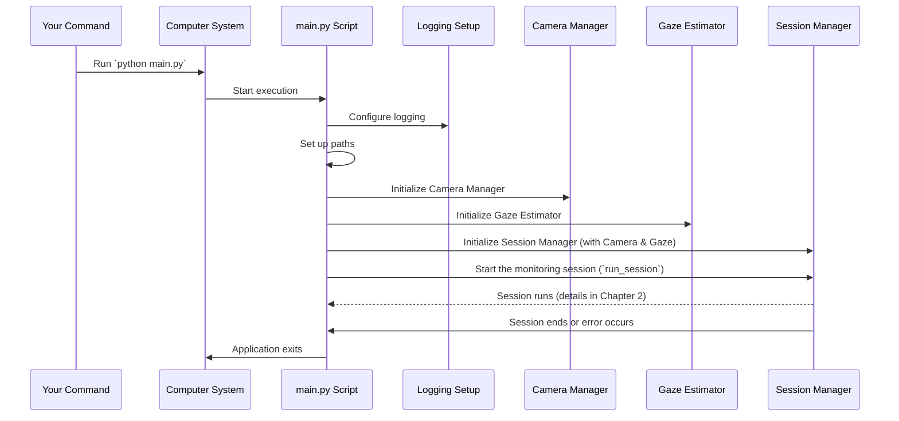

# Chapter 1: Application Entry Point

Welcome to the tutorial for the Book Attention Monitor project! We're excited to guide you through how this system works, step by step.

Every computer program needs a starting point – a place where it wakes up and begins executing instructions. Think of it like turning the key in a car's ignition or flipping the main power switch for your house. For our project, this starting point is called the **Application Entry Point**.

This chapter will introduce you to this crucial starting point, explain what it does, and show you how it kicks off the entire attention monitoring process.

## What is the Application Entry Point?

The Application Entry Point is simply the main script or function that you run to start the program. In our `Book-Attention-Monitor` project, this role is played by the `main.py` file.

When you run `python main.py` on your computer, you are essentially telling Python to start executing the code within that file from the very beginning.

## Why Do We Need a Specific Entry Point?

Imagine you have a big project with many different parts (like different rooms in a house, or different sections of an orchestra). You need a central place to:

1.  **Get Ready:** Set up everything that's needed before the main work can begin (like making sure the lights are on, or the instruments are tuned).
2.  **Gather the Team:** Initialize and prepare the different components that will work together (like the camera, the attention tracker, etc.).
3.  **Start the Show:** Tell the main process to begin.
4.  **Handle Problems:** Have a plan if something goes wrong right at the start.

The Application Entry Point (`main.py`) does exactly this for our project. It makes sure everything is properly configured and then launches the core process that monitors attention.

## How to Start the Application

Using the Application Entry Point is simple! Once you have the project code on your computer, you just need to navigate to the project's main directory in your terminal or command prompt and run a single command:

```bash
python main.py
```

That's it! This command tells your computer to find the `main.py` file and execute the code inside it.

## What Happens When You Run `main.py`?

When you run `python main.py`, a sequence of events is triggered. Here's a high-level overview:



As you can see in the diagram, `main.py` acts like a conductor, setting up the orchestra (logging, paths, components) and then giving the signal for the main performance ([Session Manager](02_session_manager_.md)'s `run_session`) to begin.

## Looking at the Code (`main.py`)

Let's peek inside the `main.py` file to see how it does its job. Don't worry about understanding every single line yet; we'll explain the important parts and the rest will be covered in later chapters.

First, the script starts by importing necessary tools (modules) and setting up some basic things:

```python
import os
import sys
import logging
from pathlib import Path

# Define paths to model files
YOLO_MODEL_PATH = "yolo12s.pt" # Path for the book detector model
L2CS_MODEL_PATH = "src/model_weights/L2CSNet_gaze360.pkl" # Path for the gaze estimator model

# Configure logging so we can see what the program is doing
logging.basicConfig(
    level=logging.INFO, # Only show important messages (INFO and above)
    format='%(asctime)s - %(name)s - %(levelname)s - %(message)s', # How messages look
    handlers=[
        logging.FileHandler('attention_monitor.log'), # Save messages to a file
        logging.StreamHandler(sys.stdout) # Also print messages to the console
    ]
)
logger = logging.getLogger(__name__)

# This helps Python find other parts of our project
project_root = str(Path(__file__).parent)
sys.path.append(project_root)

# Import the main components we'll need
from src.camera.camera_manager import CameraManager
from src.session.session_manager import SessionManager
from src.models.gaze_estimator import GazeEstimator
```

*   **Imports:** These lines bring in code from other files or Python's built-in libraries that our `main.py` script needs to use.
*   **Model Paths:** These lines define where the program should look for the pre-trained models it needs for tasks like detecting books and estimating gaze.
*   **Logging Configuration:** This is like setting up a diary for the program. It tells the program to record messages (like "Starting up", "Initializing camera", "Error occurred") and where to put them (both in a file called `attention_monitor.log` and on your screen). This is super helpful for understanding what the program is doing or if something goes wrong.
*   **`sys.path.append`:** This line helps Python find the other modules (like `CameraManager`, `SessionManager`, `GazeEstimator`) that are organized within the `src` folder of the project.
*   **Component Imports:** These lines specifically import the core classes (`CameraManager`, `SessionManager`, `GazeEstimator`) that `main.py` needs to create and use.

Next, the core logic lives inside a function called `main()`:

```python
def main():
    try:
        logger.info("Starting Book Attention Monitoring System")

        # Initialize components
        logger.info("Initializing camera manager")
        source = 0  # Default webcam source (can be changed)
        camera_manager = CameraManager(source) # Create the Camera Manager object

        logger.info("Initializing gaze estimator")
        gaze_estimator = GazeEstimator( # Create the Gaze Estimator object
            model_path=L2CS_MODEL_PATH
        )

        logger.info("Initializing session manager")
        session_manager = SessionManager( # Create the Session Manager object
            camera_manager=camera_manager, # Give it the camera manager
            gaze_analyzer=gaze_estimator, # Give it the gaze estimator
            book_detector_model_path=YOLO_MODEL_PATH # Tell it where the book model is
        )

        # Run the session
        logger.info("Starting attention monitoring session")
        session_manager.run_session() # Tell the session manager to start its work

    except Exception as e:
        # If anything goes wrong in the try block, this code runs
        logger.error(f"Application error: {str(e)}", exc_info=True)
        sys.exit(1) # Exit the program with an error code
    finally:
        # This code runs whether there was an error or not
        logger.info("Application shutdown complete")

```

*   **`def main():`:** This defines the main function where the primary actions happen.
*   **`try...except...finally`:** This is an error-handling structure.
    *   The code inside `try` is executed.
    *   If an error occurs during the `try` block, the code inside `except Exception as e:` is executed. It logs the error.
    *   The code inside `finally:` is *always* executed at the end, whether an error happened or not. Here, it logs that the application is shutting down.
*   **Initialization:** Inside the `try` block, `main()` creates instances (objects) of the three main components:
    *   `CameraManager`: This component handles getting video frames from your camera or a video file. We pass it `source=0` which typically means the default webcam. (We'll learn more in [Chapter 3: Camera Manager](03_camera_manager_.md)).
    *   `GazeEstimator`: This component will eventually figure out where someone is looking. It needs to know where to find its model file. (More details in [Chapter 4: Gaze Estimator](04_gaze_estimator_.md)).
    *   `SessionManager`: This is the central orchestrator of the main monitoring process. Crucially, we give it the `camera_manager` and `gaze_estimator` objects it needs to do its job. We also tell it the path to the model it needs for detecting books. (The core logic lives here, covered in [Chapter 2: Session Manager](02_session_manager_.md)).
*   **`session_manager.run_session()`:** After creating the `session_manager` object, `main()` calls its `run_session()` method. This is the command that tells the system to actually start capturing frames, analyzing gaze, detecting books, and monitoring attention. The program will spend most of its time inside this method until it finishes or is stopped.

Finally, there's a standard Python construct at the very end:

```python
if __name__ == "__main__":
    main()
```

*   **`if __name__ == "__main__":`:** This is a common pattern in Python scripts. It means "If this script (`main.py`) is the one being run directly (not imported as a module into another script), then call the `main()` function." This ensures that the `main()` function only runs when you execute `python main.py`, not if this file were somehow included in another Python program.

So, when you run `python main.py`, the `if __name__ == "__main__":` check is true, and the `main()` function is called, kicking off the whole process!

## Conclusion

You've learned that `main.py` is the **Application Entry Point** – the initial script that starts our Book Attention Monitor project. It's responsible for:

*   Setting up basic things like logging and paths.
*   Creating the main components ([Camera Manager](03_camera_manager_.md), [Gaze Estimator](04_gaze_estimator_.md), [Session Manager](02_session_manager_.md)).
*   Handing off control to the [Session Manager](02_session_manager_.md) to run the main monitoring process.

It's the "on switch" and the initial setup crew all in one!

Now that we know how the application starts and which component takes over for the main work, let's dive into the next chapter to understand the component responsible for controlling the overall monitoring process: the [Session Manager](02_session_manager_.md).

[Next Chapter: Session Manager](02_session_manager_.md)

---

Generated by [AI Codebase Knowledge Builder](https://github.com/The-Pocket/Tutorial-Codebase-Knowledge)