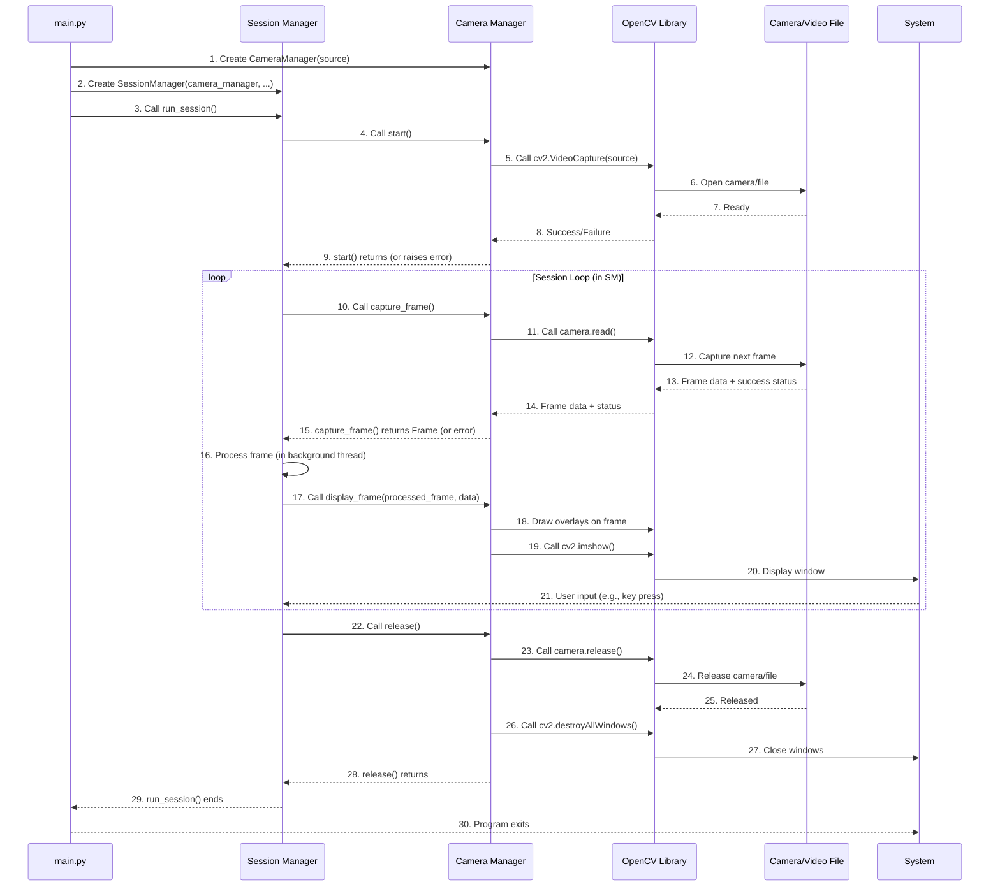

# Chapter 3: Camera Manager

Welcome back! In [Chapter 1: Application Entry Point](01_application_entry_point_.md), we saw how `main.py` kicks off the whole process, and in [Chapter 2: Session Manager](02_session_manager_.md), we learned that the Session Manager acts as the main conductor, orchestrating the continuous flow of frames and analysis.

Now, let's meet the first essential musician in our orchestra: the **Camera Manager**. If the Session Manager is the conductor, the Camera Manager is responsible for providing the very first piece of the puzzle – the visual feed, the "eyes" of the system.

## What is the Camera Manager?

The Camera Manager (`CameraManager` class in `src/camera/camera_manager.py`) has a very focused job: it's solely responsible for handling the video input for our application. Think of it as the component that knows how to talk to your webcam, open a video file, or connect to a network video stream (like a phone acting as a webcam).

Its main tasks are:

1.  **Connecting:** Establishing a connection to the chosen video source.
2.  **Capturing:** Grabbing individual pictures, or "frames," from that source, one by one.
3.  **Providing:** Making these captured frames available to other parts of the system (like the Session Manager) for processing.
4.  **Displaying:** Handling the process of showing the video window on your screen, often with results drawn on top.

Without the Camera Manager, the Session Manager would have no pictures to analyze!

## Why Do We Need a Dedicated Camera Manager?

You might think, "Can't I just use OpenCV directly to open the camera?" And yes, you totally can! However, having a dedicated `CameraManager` class gives us several benefits:

*   **Organization:** It keeps all camera-related code in one place, making the rest of the program cleaner.
*   **Flexibility:** It makes it easier to switch between different video sources (webcam, file, IP stream) without changing the core logic in the Session Manager.
*   **Control:** It provides a clear interface (`start()`, `capture_frame()`, `release()`) for other components to interact with the camera without needing to know the low-level details of how OpenCV handles video capture.
*   **Reusability:** If another part of a different project needed camera access, you could potentially reuse this component.

It's like having a specialized camera crew instead of trying to operate the camera yourself while also directing the movie!

## How the Session Manager Uses the Camera Manager

As we saw in [Chapter 2: Session Manager](02_session_manager_.md), the Session Manager is given a `CameraManager` object when it's created by `main.py`. The Session Manager then tells the Camera Manager when to start and when to provide frames.

Here's a look at that interaction (simplified from `SessionManager` code):

```python
# From src/session/session_manager.py (simplified)
# ... imports ...
from src.camera.camera_manager import CameraManager
# ... other imports and class definition ...

class SessionManager:
    def __init__(self, camera_manager: CameraManager, ...):
        # SessionManager receives the CameraManager object
        self.camera_manager = camera_manager 
        # ... other initializations ...

    def run_session(self) -> None:
        try:
            logger.info("Starting camera capture session")
            # Tell the CameraManager to start capturing
            self.camera_manager.start() 

            self.running = True
            # ... start processing thread ...

            logger.info("Entering main session loop (display loop)")
            while self.running:
                # Ask the CameraManager for the next frame
                frame = self.camera_manager.capture_frame() 
                
                if frame is None:
                    # Handle case where no frame is ready yet
                    continue 

                # ... put frame in queue for analysis ...

                # Tell the CameraManager to display the frame with overlays
                # (Note: The SessionManager prepares the 'attention_data' before calling this)
                self.camera_manager.display_frame(frame, self.last_attention_data) 

                # ... check for quit key ...
            
        finally:
            # Tell the CameraManager to stop and release resources
            self.camera_manager.release() 
            # ... other cleanup ...

```

This shows the main points:

1.  The `SessionManager` holds onto the `camera_manager` object it received during initialization.
2.  Before entering its main loop, it calls `self.camera_manager.start()` to get the camera ready.
3.  Inside the loop, it repeatedly calls `self.camera_manager.capture_frame()` to get the latest image.
4.  It calls `self.camera_manager.display_frame()` to show the frame (which includes drawing results on it).
5.  When the loop finishes, it calls `self.camera_manager.release()` to properly close the camera connection.

This is the core pattern: the Session Manager directs *when* camera actions happen, but the Camera Manager handles *how* they happen.

## Key Methods of the Camera Manager

Let's look at the main methods within the `CameraManager` class itself (`src/camera/camera_manager.py`) to understand what they do.

### 1. Initializing the Camera Manager (`__init__`)

When the `SessionManager` (or `main.py`) creates a `CameraManager` object, it needs to tell it *which* camera source to use.

```python
# From src/camera/camera_manager.py (simplified)
import cv2
# ... other imports ...

class CameraManager:
    def __init__(self, camera_source: Union[int, str] = 0):
        """
        Initializes the CameraManager.
        camera_source: An integer (like 0, 1, ...) for a webcam,
                       or a string path to a video file or IP stream URL.
        """
        self.camera_source = camera_source
        self.camera: Optional[cv2.VideoCapture] = None # This will hold the OpenCV video object
        # ... other internal variables ...

```

*   **`__init__(self, camera_source = 0)`:** This is the constructor method that runs when you create `CameraManager(...)`.
*   **`camera_source`:** This parameter is where you specify the video source.
    *   `0` (which is the default) typically means your computer's default webcam. `1`, `2`, etc., would be for other connected cameras.
    *   A string like `"path/to/my/video.mp4"` tells it to use a video file.
    *   A string like `"http://<ip_address>:<port>/video"` can be used for IP cameras or phone-as-webcam apps like DroidCam.
*   **`self.camera`:** This variable is initially `None`. It will later hold the actual object that OpenCV uses to interact with the video source after `start()` is called.

This method just stores the chosen source; it doesn't actually connect to the camera yet.

### 2. Starting the Camera (`start`)

This is where the connection to the video source actually happens.

```python
# From src/camera/camera_manager.py (simplified)
# ... __init__ method ...

    def start(self) -> None:
        """Start the camera capture"""
        logger.info(f"Attempting to open camera source: {self.camera_source}")
        
        # Use OpenCV's VideoCapture to open the source
        self.camera = cv2.VideoCapture(self.camera_source) 

        # Check if the camera opened successfully
        if not self.camera.isOpened():
            logger.error(f"Could not open camera source: {self.camera_source}")
            raise RuntimeError(f"Could not open camera source: {self.camera_source}")

        # Optional: Try to set camera properties (width, height, FPS)
        # These might not work on all cameras/sources
        self.camera.set(cv2.CAP_PROP_FRAME_WIDTH, 1280)
        self.camera.set(cv2.CAP_PROP_FRAME_HEIGHT, 720)
        self.camera.set(cv2.CAP_PROP_FPS, 30)
        
        logger.info("Camera source opened successfully.")

```

*   **`self.camera = cv2.VideoCapture(self.camera_source)`:** This is the key line. It tells OpenCV (`cv2`) to open the specified `camera_source`. The result is stored in `self.camera`.
*   **`if not self.camera.isOpened():`:** This checks if OpenCV was actually able to connect. If not, it logs an error and stops the program by raising a `RuntimeError`.
*   **`self.camera.set(...)`:** These lines are attempts to configure the camera for better quality. They might not always work depending on your camera or video source capabilities.

Once `start()` finishes successfully, the `CameraManager` is ready to start capturing frames.

### 3. Capturing a Frame (`capture_frame`)

This method grabs a single image from the connected video source.

```python
# From src/camera/camera_manager.py (simplified)
# ... start method ...

    def capture_frame(self) -> np.ndarray:
        """Captures a single frame from the camera."""
        if self.camera is None or not self.camera.isOpened():
             # This check might be redundant if start() was called, 
             # but good practice.
            raise RuntimeError("Camera not initialized or opened.")

        # Read a frame using OpenCV
        ret, frame = self.camera.read() 
        
        # 'ret' is True if frame was read successfully, False otherwise
        if not ret:
            # If it's a video file, it might mean the end of the video
            if self.is_video_file:
                logger.info("End of video file reached.")
                # In a real application, you might loop the video or stop gracefully here
                # For this project, failing to read a frame is treated as an error for simplicity
            
            logger.error("Failed to capture frame from camera.")
            raise RuntimeError("Failed to capture frame")
            
        return frame # Return the captured image data (as a NumPy array)

```

*   **`ret, frame = self.camera.read()`:** This is the core OpenCV function to read the next frame from the video source.
    *   `ret` is a boolean (True/False) indicating if the read was successful.
    *   `frame` is the actual image data, represented as a NumPy array (a common way to handle images in Python). If `ret` is False, `frame` might be `None` or an empty image.
*   **Error Handling:** The `if not ret:` block handles cases where a frame couldn't be read (e.g., camera disconnected, end of video file).
*   **Return Value:** If successful, the method returns the `frame` (the image data) to the caller (the `SessionManager`).

The Session Manager calls `capture_frame()` repeatedly inside its main loop to get the stream of images.

### 4. Displaying the Output (`display_frame`)

While `capture_frame` gets the raw image, `display_frame` is responsible for showing the *final output* frame to the user, which includes drawing things like bounding boxes around books, gaze indicators, and attention status messages on the image. The Session Manager prepares the data needed for these drawings and passes it to `display_frame`.

```python
# From src/camera/camera_manager.py (simplified)
# ... capture_frame method ...
import numpy as np # Needed for image data
import cv2 # Needed for drawing and showing

    def display_frame(self, frame: np.ndarray, attention_data: dict) -> None:
        """
        Draws overlays (like book boxes, status text) on a frame 
        and displays it in a window.
        """
        # Make a copy so we don't draw on the original frame data
        display_frame = frame.copy() 
        
        # Get frame dimensions
        h, w = display_frame.shape[:2]

        # --- Drawing Logic (Simplified) ---
        # (The actual code draws info panel, book boxes, text based on attention_data)
        # For example, drawing a dummy box:
        # cv2.rectangle(display_frame, (50, 50), (w - 50, h - 50), (0, 255, 0), 2)
        # cv2.putText(display_frame, attention_data.get('message', 'N/A'), (10, 30), cv2.FONT_HERSHEY_SIMPLEX, 1.0, (255,255,255), 2)
        # --- End Drawing Logic ---
        
        # Display the frame in a window titled 'Attention Monitor'
        cv2.imshow('Attention Monitor', display_frame)

```

*   **`display_frame(self, frame, attention_data)`:** Takes the image `frame` and a dictionary `attention_data` containing results from the analysis (book location, attention status, etc.).
*   **Drawing Overlays:** The code inside this method (simplified here) uses OpenCV drawing functions (`cv2.rectangle`, `cv2.putText`, etc.) to draw shapes and text onto the `display_frame` based on the `attention_data`.
*   **`cv2.imshow('Attention Monitor', display_frame)`:** This is the OpenCV function that actually creates or updates a window on your screen titled "Attention Monitor" and shows the modified `display_frame` image in it.

The Session Manager calls this after it has received a frame, had it processed by the background thread, and received the results.

### 5. Releasing the Camera (`release`)

When the application is shutting down (either normally or due to an error), it's important to properly close the connection to the camera or video file.

```python
# From src/camera/camera_manager.py (simplified)
# ... display_frame method ...

    def release(self) -> None:
        """Release the camera and destroy windows"""
        logger.info("Releasing camera and destroying windows")
        if self.camera:
            # Release the camera resource using OpenCV
            self.camera.release() 
            
        # Close any OpenCV windows
        cv2.destroyAllWindows() 
        logger.info("Camera released, windows destroyed.")

```

*   **`self.camera.release()`:** If the `self.camera` object exists, this calls OpenCV's method to release the underlying video resource. This is crucial to free up the camera so other applications can use it, or to properly close the video file.
*   **`cv2.destroyAllWindows()`:** This OpenCV function closes all the windows that were opened by `cv2.imshow`.

The `SessionManager` calls this method in its `finally` block (or cleanup method) to ensure resources are freed when the session ends.

## How it Works Under the Hood

Let's trace the main steps involving the Camera Manager during the application's runtime:



As you can see:

*   `main.py` creates and connects the `CameraManager` to the `SessionManager`.
*   The `SessionManager` tells the `CameraManager` when to `start()`.
*   The `CameraManager` uses the OpenCV library (`cv2`) to interact with the actual camera hardware or video file.
*   In the main loop, the `SessionManager` repeatedly asks the `CameraManager` for a frame using `capture_frame()`.
*   The `CameraManager` again uses OpenCV to read the next frame and returns it.
*   After processing, the `SessionManager` tells the `CameraManager` to show the result using `display_frame()`, which uses OpenCV to draw and show the window.
*   Finally, when stopping, the `SessionManager` tells the `CameraManager` to `release()`, which uses OpenCV to clean up the camera connection and windows.

The Camera Manager acts as the bridge between the rest of our Python code and the low-level video handling done by the powerful OpenCV library.

## Conclusion

The `CameraManager` is a focused and essential component in our system. It's the designated expert for handling video input. It connects to the video source, provides frames when asked by the [Session Manager](02_session_manager_.md), and handles displaying the final output with overlays. By abstracting camera interactions into this class, we keep our main application logic clean and flexible.

With the ability to get video frames established, we can now turn our attention to analyzing those frames. The next crucial step is figuring out where the user is looking.

[Next Chapter: Gaze Estimator](04_gaze_estimator_.md)

---

Generated by [AI Codebase Knowledge Builder](https://github.com/The-Pocket/Tutorial-Codebase-Knowledge)