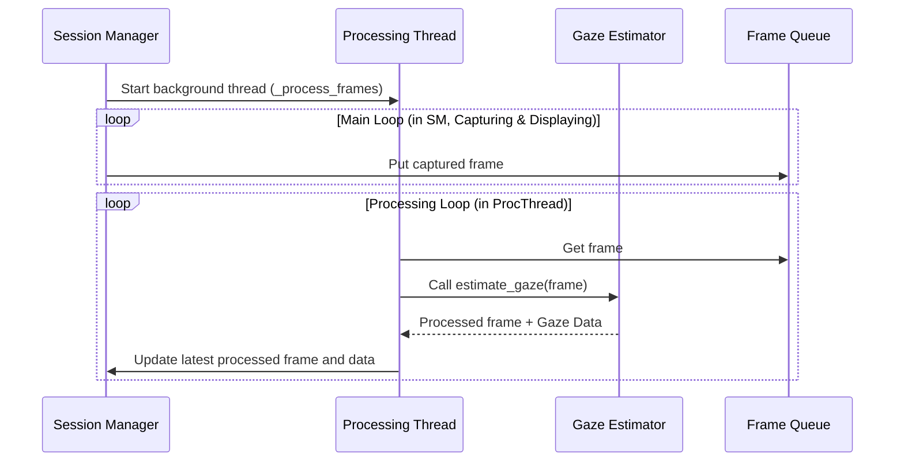
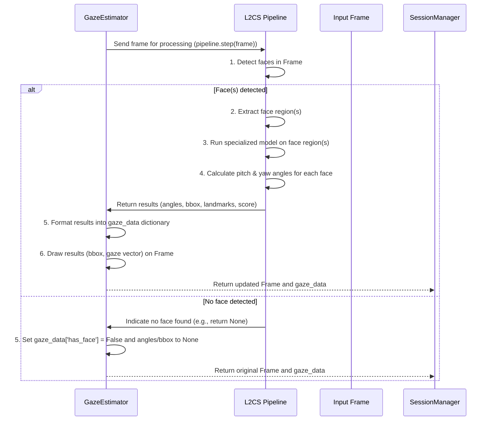

# Chapter 4: Gaze Estimator

Welcome back! In [Chapter 3: Camera Manager](03_camera_manager_.md), we learned how our application gets the crucial visual input – the video frames – from the camera. Now that we have these frames, the next big question is: what is the person in the frame actually *looking* at?

To answer this, we need a component that can analyze the image and figure out the direction of someone's gaze. This is the job of the **Gaze Estimator**.

## What is the Gaze Estimator?

Think of the Gaze Estimator (`GazeEstimator` class in `src/models/gaze_estimator.py`) as our system's dedicated **eye-tracking specialist**. When it receives a video frame from the [Camera Manager](03_camera_manager_.md) (via the [Session Manager](02_session_manager_.md)), it goes to work:

1.  **Finds Faces:** First, it looks for faces in the picture. You can't track eyes if you can't find the face they belong to!
2.  **Analyzes Eyes:** Once a face is found, it zooms in (conceptually) on the eyes and analyzes their appearance.
3.  **Estimates Direction:** Using a sophisticated model, it estimates the 3D direction of the gaze relative to the face.

The result of this analysis is usually represented as angles, commonly **pitch** (how much the person is looking up or down) and **yaw** (how much they are looking left or right).

This information is absolutely vital. By knowing approximately where the person's eyes are directed, our system can later compare that direction to the location of objects like books to determine if attention is being paid.

## Why Do We Need a Dedicated Gaze Estimator?

Estimating gaze from an image is a complex task that requires specialized knowledge and often sophisticated machine learning models. We need a dedicated `GazeEstimator` component for a few key reasons:

*   **Specialization:** Gaze estimation involves finding faces, detecting specific points on the face (like corners of the eyes), and running complex calculations or neural networks. Putting all this logic in one place keeps the code organized.
*   **Using Models:** This task relies heavily on pre-trained models (like the L2CS model used in this project). The `GazeEstimator` handles loading and running these models.
*   **Abstraction:** The [Session Manager](02_session_manager_.md) and other parts of the system don't need to know *how* gaze is estimated, only that they can send a frame to the `GazeEstimator` and get gaze data back.

It acts like hiring a professional eye doctor – you give them the patient (the frame), and they give you the diagnosis (the gaze direction), without you needing to be an expert in ophthalmology!

## How the Session Manager Uses the Gaze Estimator

As we saw in [Chapter 2: Session Manager](02_session_manager_.md), the `main.py` script initializes the `GazeEstimator` and passes the object to the `SessionManager`. The `SessionManager` then uses this object inside its background processing loop to analyze frames.

Here's a simplified view of that interaction, recalling the processing thread logic mentioned in Chapter 2:



The key interaction is when the `Processing Thread` takes a frame from the `Frame Queue` and calls the `estimate_gaze()` method on the `Gaze Estimator` object (`GE`).

Let's look at a snippet from the `SessionManager` (simplified from `src/session/session_manager.py`), specifically inside the `_process_frames` method (the one running in the background thread):

```python
# From src/session/session_manager.py (simplified _process_frames method)
# ... imports ...
# self.gaze_analyzer is the GazeEstimator object received in __init__
# self.book_detector is the BookDetector object
# self.attention_monitor is the AttentionMonitor object

def _process_frames(self):
    """This method runs in a separate thread to process frames."""
    logger.info("Processing thread started")
    while self.running: # Keep processing as long as session is running
        if not self.frame_queue.empty():
            frame = self.frame_queue.get() # Get a frame from the queue

            try:
                # --- Use the Gaze Estimator ---
                logger.debug("Running gaze estimation")
                # Call the estimate_gaze method
                processed_frame_gaze, gaze_data = self.gaze_analyzer.estimate_gaze(frame)
                # --- Gaze estimation done, gaze_data contains the results ---

                # --- Use the Book Detector (covered in next chapter) ---
                # ... (code to call book_detector and get book_data) ...

                # --- Use the Attention Monitor (covered later) ---
                # ... (code to call attention_monitor using gaze_data and book_data) ...

                # Store results for the display thread
                self.last_processed_frame = processed_frame_gaze # Or combined frame
                self.last_attention_data = {...} # Store the attention results

            except Exception as e:
                logger.error(f"Error processing frame: {str(e)}", exc_info=True)
            finally:
                self.frame_queue.task_done() # Tell the queue this frame is done

        else:
            time.sleep(0.001) # Wait a tiny bit if queue is empty

```

This snippet shows that the `_process_frames` method retrieves a frame and then calls `self.gaze_analyzer.estimate_gaze(frame)`. It receives back a `processed_frame_gaze` (the original frame with gaze visuals drawn on it) and a `gaze_data` dictionary containing the estimated gaze angles and other information. This `gaze_data` is then used by the `AttentionMonitor` (Chapter 6) to figure out attention.

## Key Method: `estimate_gaze`

The primary way to interact with the `GazeEstimator` is through its `estimate_gaze` method.

```python
# From src/models/gaze_estimator.py (simplified method signature)
import numpy as np
from typing import Tuple, Dict, Any

class GazeEstimator:
    # ... __init__ method ...

    def estimate_gaze(self, frame: np.ndarray) -> Tuple[np.ndarray, Dict[str, Any]]:
        """
        Estimates gaze from a single video frame.

        Args:
            frame: The input frame as a NumPy array (image data).

        Returns:
            A tuple containing:
            - processed_frame: The original frame with gaze visuals drawn (e.g., face box, gaze vector).
            - gaze_data: A dictionary with gaze estimation results.
        """
        # ... implementation details calling the L2CS pipeline ...
        # ... extracts pitch, yaw, face bounding box (bbox), etc. ...
        # ... handles cases where no face is found ...
        # ... draws visuals on the frame ...
        # ... returns results ...

```

*   **Input (`frame`):** It takes one argument, `frame`, which is a NumPy array representing the image data for a single frame (like the ones provided by the [Camera Manager](03_camera_manager_.md)).
*   **Output (Tuple):** It returns *two* things:
    *   `processed_frame`: This is a version of the input `frame` but with things drawn on it by the Gaze Estimator itself, such as boxes around detected faces and lines showing the estimated gaze direction. This is helpful for visualizing what the estimator is seeing.
    *   `gaze_data`: This is a Python dictionary containing the important results. It will look something like this (values will vary):

        ```python
        {
            'pitch': 5.2,  # Angle in degrees (positive = looking up, negative = looking down)
            'yaw': -10.1, # Angle in degrees (positive = looking right, negative = looking left)
            'has_face': True, # Was a face successfully detected?
            'scores': 0.95, # Confidence score (how sure the model is)
            'bbox': [x1, y1, x2, y2], # Bounding box coordinates of the detected face
            'landmarks': [[x1, y1], ...], # Coordinates of key facial points (eyes, nose, mouth)
            'message': 'Face detected' # Status message
        }
        ```
    *   If no face is detected, `has_face` will be `False`, and `pitch`, `yaw`, `bbox`, and `landmarks` will likely be `None`.

## Under the Hood: How Gaze Estimation Works (Simplified)

So, what magic happens inside `estimate_gaze`? The `GazeEstimator` uses a specialized library called **L2CS** (short for Look-Likely-to-See). This library contains the pre-trained machine learning model that does the heavy lifting.

Here's a simplified step-by-step process when `estimate_gaze(frame)` is called:



Let's peek at the code in `src\models\gaze_estimator.py` to see the core parts:

### 1. Initialization (`__init__`)

When the `GazeEstimator` is created by `main.py`, it loads the L2CS model.

```python
# From src/models/gaze_estimator.py (simplified __init__)
from l2cs import Pipeline # Import the core L2CS tool
import torch # Library for machine learning models

class GazeEstimator:
    def __init__(self, model_path: str = "src/model_weights/L2CSNet_gaze360.pkl"):
        """
        Initializes the GazeEstimator by loading the L2CS model.
        """
        # Check if a GPU is available and use it, otherwise use the CPU
        self.device = torch.device('cuda' if torch.cuda.is_available() else 'cpu')
        logger.info(f"Using device for Gaze Estimator: {self.device}")

        # Create an L2CS Pipeline object, giving it the model file path
        # This object contains the complex logic for face detection and gaze estimation
        self.pipeline = Pipeline(
            weights=model_path, # Path to the trained model file
            arch='ResNet50',    # The type of neural network architecture
            device=self.device  # Whether to use CPU or GPU
        )
        logger.info("Gaze Estimator initialized with L2CS pipeline")

```

*   **`import Pipeline from l2cs`:** This brings in the main class from the L2CS library that handles the gaze estimation process.
*   **`self.device = torch.device(...)`:** This checks if your computer has an NVIDIA graphics card (GPU) and prefers to use it (`cuda`) because GPUs are much faster for running these types of models. If not, it falls back to using the main processor (CPU).
*   **`self.pipeline = Pipeline(...)`:** This line creates the core L2CS object (`self.pipeline`). We tell it where to find the trained model (`weights`), what kind of model it is (`arch='ResNet50'`), and which device (CPU/GPU) to use. This `self.pipeline` object is what we'll use later to actually process frames.

### 2. Estimating Gaze (`estimate_gaze`)

This method is where the input frame is sent to the loaded L2CS model for processing.

```python
# From src/models/gaze_estimator.py (simplified estimate_gaze)
import numpy as np
import cv2 # Used for drawing on the frame
from typing import Tuple, Dict, Any
from l2cs import render # Helper function from l2cs to draw results

    def estimate_gaze(self, frame: np.ndarray) -> Tuple[np.ndarray, Dict[str, Any]]:
        """
        Estimates gaze from a single video frame using the L2CS pipeline.
        """
        gaze_data = {
            'pitch': None, 'yaw': None, 'has_face': False,
            'scores': 0.0, 'bbox': None, 'landmarks': None,
            'message': 'No face detected'
        }

        try:
            # --- The core step: Pass the frame to the L2CS pipeline ---
            # The pipeline does face detection, landmark detection,
            # and gaze angle estimation internally.
            results = self.pipeline.step(frame) 
            # --- Results object contains the findings ---

            # Check if the pipeline found any faces and estimated gaze
            if results is not None:
                # Extract the key pieces of information from the results object
                # Assuming only one face is processed for simplicity in this project
                pitch = results.pitch[0] # Get pitch for the first detected face
                yaw = results.yaw[0]     # Get yaw for the first detected face
                bbox = results.bboxes[0] # Get bounding box for the first detected face
                landmarks = results.landmarks[0] # Get landmarks for the first detected face
                scores = results.scores[0] # Get score for the first detected face

                # Update our gaze_data dictionary
                gaze_data.update({
                    'pitch': pitch,
                    'yaw': yaw,
                    'has_face': True,
                    'scores': scores,
                    'bbox': bbox,
                    'landmarks': landmarks,
                    'message': 'Face detected'
                })

                # Use a helper function from L2CS to draw the results on the frame
                processed_frame = render(frame, results) 
                logger.debug(f"Gaze detected: Pitch={pitch:.2f}, Yaw={yaw:.2f}")

                return processed_frame, gaze_data # Return the frame with drawings and the data

            else:
                # If results is None, it means no face was detected by the pipeline
                logger.debug("No faces detected in frame by L2CS")
                # gaze_data is already set to 'No face detected' by default

        except ValueError as e:
             # The pipeline might raise ValueError if no faces are found
             logger.warning(f"ValueError during gaze estimation: {e}")
             # gaze_data remains 'No face detected'

        except Exception as e:
            # Catch any other unexpected errors
            logger.error(f"Unexpected error during gaze estimation: {str(e)}", exc_info=True)
            gaze_data['message'] = f'Error: {str(e)}'

        # If we reached here, either no face was found or an error occurred
        # Return the original frame and the potentially updated gaze_data (with has_face=False)
        return frame, gaze_data

```

*   **`self.pipeline.step(frame)`:** This is the central command. We give the input `frame` to the `step` method of the L2CS `pipeline` object. The `l2cs` library does all the hard work inside this method: finding faces, running the model, and calculating angles.
*   **`results = ...`:** The `step` method returns a `results` object if faces were found, or `None` otherwise.
*   **`if results is not None:`:** We check if the pipeline found anything.
*   **Extracting Data:** If `results` is not `None`, we extract the calculated `pitch`, `yaw`, `bbox`, `landmarks`, and `scores`. Note the `[0]` indexing – this project assumes only one main face will be tracked, so we take the results for the first face detected.
*   **Updating `gaze_data`:** The extracted data is put into the `gaze_data` dictionary that will be returned.
*   **`processed_frame = render(frame, results)`:** The `l2cs` library provides a handy `render` function that takes the original frame and the results and automatically draws things like the face box and the gaze direction line on the frame. This creates the `processed_frame` we return.
*   **Error Handling:** The `try...except` block catches potential issues, like `ValueError` which L2CS might raise if no face is found, or other general errors. If an error occurs, `has_face` is set to `False` and appropriate data is set to `None`.

This method effectively encapsulates all the complexity of running the gaze estimation model, providing a clean interface for the [Session Manager](02_session_manager_.md) to get the gaze information it needs.

## Conclusion

The `GazeEstimator` is our specialized tool for analyzing video frames to determine where a person is looking. It leverages a powerful pre-trained model (L2CS) to detect faces, analyze eye direction, and output gaze angles (pitch and yaw) along with face location and other details.

Working closely with the [Camera Manager](03_camera_manager_.md) (which provides the frames) and orchestrated by the [Session Manager](02_session_manager_.md), the `GazeEstimator` provides the crucial "line of sight" information that we'll need later to determine if that line of sight intersects with something specific.

Now that we can capture frames and figure out where the user is looking, the next logical step is to figure out *what* might be in their field of vision, specifically, are there any books?

[Next Chapter: Book Detector](05_book_detector_.md)

---

Generated by [AI Codebase Knowledge Builder](https://github.com/The-Pocket/Tutorial-Codebase-Knowledge)