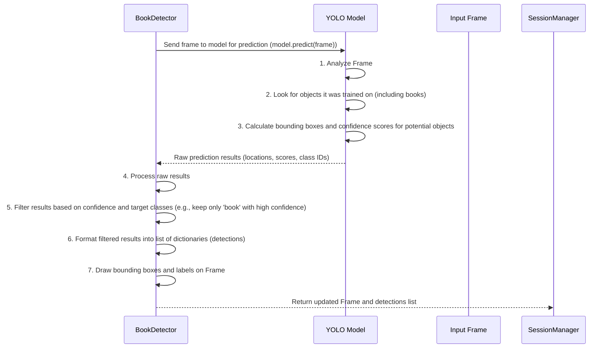

# Chapter 5: Book Detector

Welcome back! So far, we've learned how our application starts ([Chapter 1: Application Entry Point](01_application_entry_point_.md)), how the main process is managed ([Chapter 2: Session Manager](02_session_manager_.md)), how we get video frames ([Chapter 3: Camera Manager](03_camera_manager_.md)), and how we figure out where the person in the video is looking ([Chapter 4: Gaze Estimator](04_gaze_estimator_.md)).

Now we have frames and we know the user's gaze direction. But what is the user potentially looking *at*? In this project, we care specifically about whether they are looking at a *book*. This is where the **Book Detector** comes in.

## What is the Book Detector?

Think of the Book Detector (`BookDetector` class in `src/models/book_detector.py`) as our system's **specialized librarian or object-finding expert**. Its primary job is to scan the video frame provided by the [Camera Manager](03_camera_manager_.md) and figure out if any books are visible.

If it finds a book, it doesn't just say "Yep, there's a book!". It's more specific:

1.  It draws a **bounding box** (a rectangle) around the book to show exactly where it is in the frame.
2.  It reports the **location** of this box (the coordinates).
3.  It reports its **confidence** level (how sure it is that it's actually a book).

This information – especially the location of the book's bounding box – is crucial. The [Attention Monitor](06_attention_monitor_.md) will later compare the user's gaze direction with the location of these book boxes to determine if the user is paying attention to a book.

## Why Do We Need a Dedicated Book Detector?

Identifying specific objects like books in an image or video is a task that computers aren't naturally good at. It requires advanced techniques, often involving machine learning and complex models trained on thousands of images of books.

Having a dedicated `BookDetector` component provides the same benefits we saw with the [Gaze Estimator](04_gaze_estimator_.md):

*   **Specialization:** All the complex logic for finding objects is kept in one place.
*   **Using Models:** It handles loading and running the pre-trained object detection model (like YOLO, which is used in this project).
*   **Abstraction:** Other parts of the system (like the [Session Manager](02_session_manager_.md) or [Attention Monitor](06_attention_monitor_.md)) don't need to know *how* books are detected; they just ask the `BookDetector` to `detect_objects` and get the results.

It's like asking a skilled detective to find a specific item – you tell them what to look for (a book) and give them the area to search (the frame), and they give you the result (found it here!).

## How the Session Manager Uses the Book Detector

The [Session Manager](02_session_manager_.md) is the conductor that orchestrates all the different components. It's responsible for creating the `BookDetector` object and then calling its main method to get book information for each frame.

Remember the `_process_frames` method running in the background thread within the `SessionManager`? This is where the `BookDetector` is used, right alongside the [Gaze Estimator](04_gaze_estimator_.md).

Here's a simplified look at that part of the `_process_frames` method (from `src/session/session_manager.py`):

```python
# From src/session/session_manager.py (simplified _process_frames method)
# ... imports ...
# self.book_detector is the BookDetector object

def _process_frames(self):
    """This method runs in a separate thread to process frames."""
    logger.info("Processing thread started")
    while self.running: # Keep processing as long as session is running
        if not self.frame_queue.empty():
            frame = self.frame_queue.get() # Get a frame from the queue

            try:
                # --- Use the Gaze Estimator (from Chapter 4) ---
                # ... (code to call gaze_analyzer and get gaze_data) ...

                # --- Use the Book Detector ---
                logger.debug("Running book detection")
                # Call the detect_objects method
                processed_frame_books, book_detections = self.book_detector.detect_objects(frame)
                # --- Book detection done, book_detections contains list of books found ---

                # --- Use the Attention Monitor (covered later) ---
                # ... (code to call attention_monitor using gaze_data and book_detections) ...

                # Store results for the display thread (combining visuals from both)
                # self.last_processed_frame = combine_visuals(processed_frame_gaze, processed_frame_books) # Conceptually combine
                # self.last_attention_data = {...} # Store the attention results including book info

            except Exception as e:
                logger.error(f"Error processing frame: {str(e)}", exc_info=True)
            finally:
                self.frame_queue.task_done() # Tell the queue this frame is done

        else:
            time.sleep(0.001) # Wait a tiny bit if queue is empty
```

This snippet shows the key line: `processed_frame_books, book_detections = self.book_detector.detect_objects(frame)`. The Session Manager calls the `detect_objects` method on its `book_detector` object, passing the current `frame`. It receives two things back: an image (`processed_frame_books`) with the detected books drawn on it, and a list (`book_detections`) containing the details about each book found (their locations, etc.).

## Key Method: `detect_objects`

The main way other parts of the system interact with the `BookDetector` is by calling its `detect_objects` method.

```python
# From src/models/book_detector.py (simplified method signature)
import numpy as np
from typing import Tuple, List, Optional, Dict, Any

class BookDetector:
    # ... __init__ method ...

    def detect_objects(self, frame: np.ndarray, confidence: float = 0.5, classes: List[int] = None) -> Tuple[np.ndarray, List[Dict[str, Any]]]:
        """
        Detects objects (like books) in a single video frame using the YOLO model.

        Args:
            frame: The input frame as a NumPy array (image data).
            confidence: Minimum confidence score for a detection to be included.
            classes: Optional list of class IDs to filter detections (e.g., just books).

        Returns:
            A tuple containing:
            - processed_frame: The original frame with detection boxes and labels drawn.
            - detections: A list of dictionaries, each describing a detected object.
        """
        # ... implementation details calling the YOLO model ...
        # ... extracts bounding boxes, confidence, class IDs, names ...
        # ... handles cases where no objects are found ...
        # ... draws visuals on the frame ...
        # ... returns results ...

```

*   **Input (`frame`):** It takes the video frame as a NumPy array.
*   **Optional Arguments (`confidence`, `classes`):** You can specify how confident the model needs to be to consider something a detection (`confidence`, default is 50%) and optionally filter to look for only specific types of objects (`classes`). The `SessionManager` likely uses these to focus on book classes and filter weak detections.
*   **Output (Tuple):** It returns two things:
    *   `processed_frame`: This is a copy of the input `frame` with the detected objects (like books) highlighted by drawing bounding boxes and labels on them. This is useful for visualization.
    *   `detections`: This is a list. Each item in the list is a dictionary describing *one* detected object. For example, if two books were found, the list would have two dictionaries. A dictionary for a book might look like this:

        ```python
        {
            'bbox': (x1, y1, x2, y2), # Tuple of (top-left X, top-left Y, bottom-right X, bottom-right Y) pixel coordinates
            'confidence': 0.85,       # How confident the model is (e.g., 85%)
            'class_id': 11,           # The numerical ID assigned to the 'book' class by the model
            'class_name': 'book'      # The human-readable name of the class
        }
        ```
    *   If no objects are detected with enough confidence, the `detections` list will be empty `[]`.

The Session Manager receives this list of `detections` and uses the bounding box information (`'bbox'`) to check if the user's gaze point falls inside any of them.

## Under the Hood: How Book Detection Works (Simplified)

The `BookDetector` uses a powerful, pre-trained object detection model from the **YOLO** family (You Only Look Once). These models are specifically designed to scan an entire image very quickly and identify multiple objects and their locations simultaneously.

Here's a simplified step-by-step process when `detect_objects(frame)` is called:



Let's peek at the code in `src\models\book_detector.py` to see the core parts.

### 1. Initialization (`__init__`)

When the `BookDetector` is created by `main.py` (which is passed the path to the YOLO model), it loads the pre-trained model.

```python
# From src/models/book_detector.py (simplified __init__)
import torch # Library for machine learning models
from ultralytics import YOLO # Import the YOLO library

logger = logging.getLogger(__name__)

class BookDetector:
    def __init__(self, model_path: str = "yolov12s.pt"):
        """
        Initializes the BookDetector by loading the YOLO model.
        """
        # Load the YOLO model from the specified path
        self.model = YOLO(model_path)
        
        # Check if a GPU is available and use it, otherwise use the CPU
        self.device = "cuda" if torch.cuda.is_available() else "cpu"
        logger.info(f"Using device for Book Detector: {self.device}")
        
        # Move the model to the selected device (GPU or CPU)
        self.model.to(self.device)
        
        logger.info("Book Detector initialized with YOLO model")

```

*   **`from ultralytics import YOLO`:** This imports the necessary class from the `ultralytics` library, which provides an easy way to use YOLO models.
*   **`self.model = YOLO(model_path)`:** This line loads the pre-trained YOLO model from the file specified by `model_path`. The `YOLO` object (`self.model`) now contains the complex neural network ready to analyze images.
*   **`self.device = ...` and `self.model.to(self.device)`:** Similar to the Gaze Estimator, this checks for a GPU and tells the model to use it for faster processing if available.

### 2. Detecting Objects (`detect_objects`)

This method takes the input frame and sends it to the loaded YOLO model for analysis.

```python
# From src/models/book_detector.py (simplified detect_objects - Part 1)
import numpy as np
from typing import Tuple, List, Dict, Any
import cv2 # Used for drawing
# ... imports ...

class BookDetector:
    # ... __init__ and other methods ...

    def detect_objects(self, frame: np.ndarray, confidence: float = 0.5, classes: List[int] = None) -> Tuple[np.ndarray, List[Dict[str, Any]]]:
        """
        Detects objects (like books) in a single video frame using the YOLO model.
        """
        detections = [] # Start with an empty list for our results

        try:
            # --- The core step: Pass the frame to the YOLO model's predict method ---
            # verbose=False keeps the model from printing extra info
            # conf=confidence sets the minimum confidence threshold
            # classes=classes limits detection to specific types if provided
            results = self.model.predict(frame, verbose=False, conf=confidence, classes=classes)[0] 
            # --- 'results' object contains the raw findings ---

            # Check if the model found anything
            if results and hasattr(results, 'boxes') and len(results.boxes) > 0:
                # --- Now process the raw results into our desired dictionary format ---
                # ... (See Part 2 below) ...

            else:
                # If no objects were detected by the model above the confidence threshold
                logger.debug("No detections found in frame")

            # --- Now draw the detections on the frame ---
            processed_frame = self.draw_detections(frame, detections) 
            
            # Return the frame with drawings and our structured list of detections
            return processed_frame, detections 
            
        except Exception as e:
            logger.error(f"Error in object detection: {str(e)}")
            # Return the original frame and an empty list of detections if error occurs
            return frame, []

```

```python
# From src/models/book_detector.py (simplified detect_objects - Part 2: Processing Results)
# This snippet shows the loop that runs if results were found in Part 1

# Assuming 'results' object exists from self.model.predict(...) in Part 1

# results.boxes.data.tolist() gives a list of detection lists like [x1, y1, x2, y2, confidence, class_id]
for result in results.boxes.data.tolist():
    try:
        # Extract the values for each detection
        x1, y1, x2, y2, confidence, class_id = result 
        
        # Get the human-readable class name (e.g., 'book')
        class_name = results.names[int(class_id)] 

        # Add this detection's info to our list in a dictionary format
        detections.append({
            'bbox': (int(x1), int(y1), int(x2), int(y2)), # Store bbox as integers
            'confidence': float(confidence),
            'class_id': int(class_id),
            'class_name': class_name
        })
    except (ValueError, IndexError) as e:
        # Log a warning if a single detection result is strangely formatted
        logger.warning(f"Error processing detection result: {str(e)}")
        continue # Skip this malformed result and continue with the next one

# After the loop, 'detections' list contains all processed detection dictionaries
# ... (Continue with drawing detections and returning results, as in Part 1) ...

```

*   **`self.model.predict(...)`:** This is the central command. We give the input `frame` to the model's `predict` method. We pass `verbose=False` to keep the output clean, and `conf` and `classes` to control which detections we're interested in. The `[0]` at the end selects the results for the first image in the batch (since we process one frame at a time).
*   **`results = ...`:** The `predict` method returns a `results` object containing the model's findings (bounding boxes, scores, etc.).
*   **`if results and ...`:** We check if the model found any objects (`len(results.boxes) > 0`).
*   **Processing Results (`for result in ...`):** If objects were found, we loop through the results. For each detected object, we extract its coordinates (`x1`, `y1`, `x2`, `y2`), `confidence`, and `class_id`. We also look up the `class_name` (like 'book') using `results.names`.
*   **`detections.append({...})`:** We organize the extracted data into a dictionary and add it to our `detections` list. This list is what the `SessionManager` will receive.
*   **`processed_frame = self.draw_detections(frame, detections)`:** After processing all results into the `detections` list, we call another method (`draw_detections`) to visualize these findings on the original `frame`.
*   **Return Value:** Finally, we return the frame with drawings and the list of `detections`.
*   **Error Handling:** The `try...except` block catches potential errors during the prediction or result processing. If an error occurs, it logs it and returns the original frame and an empty detection list to avoid crashing.

### 3. Drawing Detections (`draw_detections`)

This method takes a frame and the list of detected objects and uses OpenCV to draw the visual indicators (boxes and labels).

```python
# From src/models/book_detector.py (simplified draw_detections)
import numpy as np
import cv2 # Needed for drawing functions
from typing import List, Dict, Any

class BookDetector:
    # ... __init__ and detect_objects methods ...

    def draw_detections(self, frame: np.ndarray, detections: List[Dict[str, Any]]) -> np.ndarray:
        """
        Draws bounding boxes and labels on the frame based on the detections list.
        """
        # We draw directly on the frame received
        
        # Loop through each detected object in the list
        for detection in detections:
            # Get the bounding box coordinates
            x1, y1, x2, y2 = detection['bbox']
            # Create a label string with class name and confidence score
            label = f"{detection['class_name']} {detection['confidence']:.2f}"
            
            # --- Use OpenCV to draw on the frame ---
            # Draw a rectangle around the object
            # cv2.rectangle(image, pt1, pt2, color, thickness)
            cv2.rectangle(frame, (x1, y1), (x2, y2), (0, 255, 0), 2) # Green box, thickness 2
            
            # Put the label text near the box
            # cv2.putText(image, text, org, fontFace, fontScale, color, thickness)
            cv2.putText(frame, label, (x1, y1 - 10), # Position text slightly above the box
                       cv2.FONT_HERSHEY_SIMPLEX, 0.5, # Font type and size
                       (0, 255, 0), 2) # Green text, thickness 2
            # --- End OpenCV drawing ---
            
        # Return the frame with all the drawings added
        return frame 

```

*   **`for detection in detections:`:** It loops through every dictionary in the `detections` list provided by `detect_objects`.
*   **`x1, y1, x2, y2 = detection['bbox']`:** It extracts the coordinates for the current detection's bounding box.
*   **`label = f"{...}"`:** It creates a text label combining the object's class name (like 'book') and its confidence score (formatted nicely).
*   **`cv2.rectangle(...)`:** This is an OpenCV function that draws a rectangle. We tell it which image to draw on (`frame`), the coordinates of the top-left corner (`(x1, y1)`) and bottom-right corner (`(x2, y2)`), the color (e.g., `(0, 255, 0)` is green), and the thickness of the line.
*   **`cv2.putText(...)`:** This OpenCV function draws text. We provide the image, the text (`label`), the starting position for the text (`(x1, y1 - 10)` puts it slightly above the box), the font, the size, the color, and thickness.
*   **Return Value:** The method returns the `frame` after all the boxes and labels have been drawn on it.

This decorated `frame` is the `processed_frame_books` returned by `detect_objects`, which the Session Manager can then combine with the gaze visualizations and display.

## Conclusion

The `BookDetector` is a crucial component that adds spatial awareness to our system. It takes video frames and, using a powerful pre-trained model like YOLO, finds the location of objects, specifically books, marking them with bounding boxes and reporting their coordinates and confidence levels.

This information, along with the gaze direction provided by the [Gaze Estimator](04_gaze_estimator_.md), gives the application the raw data it needs to answer the ultimate question: Is the user looking at a book? In the next chapter, we'll see how the [Attention Monitor](06_attention_monitor_.md) takes these pieces of information and determines the user's attention status.

[Next Chapter: Attention Monitor](06_attention_monitor_.md)

---

Generated by [AI Codebase Knowledge Builder](https://github.com/The-Pocket/Tutorial-Codebase-Knowledge)