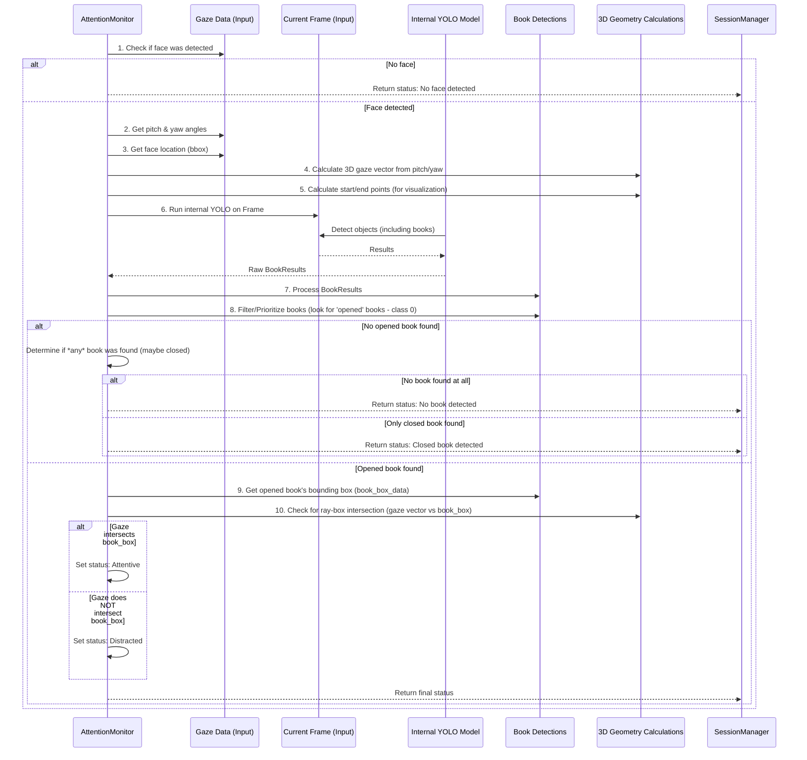

# Chapter 6: Attention Monitor

Welcome back for the final chapter of our Book Attention Monitor tutorial! In the previous chapters, we built up the pieces: we learned how the application starts ([Chapter 1: Application Entry Point](01_application_entry_point_.md)), how the main loop is managed by the [Session Manager](02_session_manager_.md) ([Chapter 2: Session Manager](02_session_manager_.md)), how we get frames from the camera ([Chapter 3: Camera Manager](03_camera_manager_.md)), how we figure out where the person is looking ([Chapter 4: Gaze Estimator](04_gaze_estimator_.md)), and how we detect books and their locations in the frame ([Chapter 5: Book Detector](05_book_detector_.md)).

Now we have all the necessary ingredients: we know the user's gaze direction, and we know where the books are. The big question is: **How do we combine these pieces of information to figure out if the user is actually paying attention to a book?**

This is the critical job of the **Attention Monitor**.

## What is the Attention Monitor?

The Attention Monitor (`AttentionMonitor` class in `src/analysis/attention_monitor.py`) is the **brain** of our system. It's the component that takes the raw analysis results from the [Gaze Estimator](04_gaze_estimator_.md) and the [Book Detector](05_book_detector_.md) and applies the core logic to make the final decision about attention.

Think of it like a detective who gathers clues from different sources:

*   **Clue 1 (from [Gaze Estimator](04_gaze_estimator_.md)):** "The person is looking roughly in *this* direction (pitch and yaw angles) from *this* location (face center)."
*   **Clue 2 (from [Book Detector](05_book_detector_.md)):** "There is a book located in *this* area of the frame (bounding box coordinates), and it is *opened*."

The Attention Monitor takes these clues and asks the key question: **"Does the person's line of sight intersect with the bounding box of an *opened* book?"**

Based on the answer, and considering things like whether a face and an opened book were even found, it determines the **attention status** and provides a clear message:

*   Attentive (looking at an opened book)
*   Distracted (opened book detected, but not looking at it)
*   No book detected
*   No face detected
*   ...and so on.

## Why Do We Need a Dedicated Attention Monitor?

While the [Gaze Estimator](04_gaze_estimator_.md) and [Book Detector](05_book_detector_.md) are experts at their specific tasks (analyzing gaze, finding books), they don't know anything about the project's goal: monitoring *book attention*.

The `AttentionMonitor` is needed to:

*   **Combine Data:** Bring together information from different sources.
*   **Apply Logic:** Implement the specific rules that define "attention" for this project (e.g., gaze must intersect an *opened* book).
*   **Make Decisions:** Produce a single, clear attention status.
*   **Isolate Logic:** Keep the core attention-determining logic separate from the data acquisition ([Camera Manager](03_camera_manager_.md)) and raw analysis ([Gaze Estimator](04_gaze_estimator_.md), [Book Detector](05_book_detector_.md)).

It's the component that truly defines what "Book Attention" means in the context of this project.

## How the Session Manager Uses the Attention Monitor

Just like with the [Gaze Estimator](04_gaze_estimator_.md) and [Book Detector](05_book_detector_.md), the [Session Manager](02_session_manager_.md) is responsible for creating the `AttentionMonitor` object and calling its main method during the frame processing loop.

Remember the `_process_frames` method running in the background thread within the `SessionManager`? This is where the `AttentionMonitor` is used after the gaze and book data have (conceptually) been gathered.

Here's a simplified look at that part of the `_process_frames` method (from `src/session/session_manager.py`), focusing on where the `AttentionMonitor` fits in:

```python
# From src/session/session_manager.py (simplified _process_frames method)
# ... imports ...
# self.gaze_analyzer is the GazeEstimator object
# self.book_detector is the BookDetector object
# self.attention_monitor is the AttentionMonitor object

def _process_frames(self):
    """This method runs in a separate thread to process frames."""
    # ... setup ...
    while self.running: 
        if not self.frame_queue.empty():
            frame = self.frame_queue.get() 

            try:
                # --- 1. Use the Gaze Estimator (Chapter 4) ---
                # This step gets face location and gaze pitch/yaw
                processed_frame_gaze, gaze_data = self.gaze_analyzer.estimate_gaze(frame) 

                # --- 2. Use the Book Detector (Chapter 5) ---
                # This step finds book locations and states (opened/closed)
                # processed_frame_books, book_detections = self.book_detector.detect_objects(frame) 
                # Note: The actual AttentionMonitor code snippet provided later *also* runs YOLO internally.
                # For this conceptual flow, imagine the Book Detector results are ready here.
                # Let's proceed assuming the AttentionMonitor will handle the book detection internally,
                # based on the provided code, though the project structure implies otherwise.

                # --- 3. Use the Attention Monitor ---
                logger.debug("Running attention analysis")
                # Pass the original frame and the gaze data to the Attention Monitor
                attention_status = self.attention_monitor.analyze_attention(
                    frame.copy(), # Pass a copy to be safe
                    gaze_data
                    # If BookDetector ran first, we'd pass book_detections here too.
                    # But the provided code runs YOLO internally, so we just pass frame & gaze_data.
                )
                # --- Attention analysis done, attention_status contains the decision ---

                # Store results for the display thread (combine visuals and status)
                # The AttentionMonitor's analysis method returns the final status dict.
                # We'll need to ensure the final frame for display incorporates all visuals (gaze + book + status).
                # The actual code handles this by having AttentionMonitor draw status and relying on
                # GazeEstimator's processed_frame, while AttentionMonitor *also* runs YOLO for book info internally.
                # This implies SessionManager might combine frames or AttentionMonitor
                # needs the book detector results passed in OR re-runs detection.
                # Based on the provided AttentionMonitor code, it re-runs YOLO detection internally.
                # So, let's update the conceptual flow to match the code snippet's reality.

                # REVISED Conceptual Flow based on the provided AttentionMonitor code snippet:
                # 1. Get frame (main loop)
                # 2. GazeEstimator analyzes frame -> gaze_data (pitch, yaw, face_bbox), processed_frame_gaze
                # 3. AttentionMonitor receives frame and gaze_data
                # 4. AttentionMonitor INTERNALLY runs YOLO (Book Detection)
                # 5. AttentionMonitor analyzes gaze_data and internal book detection results
                # 6. AttentionMonitor determines attention_status (and potentially draws on frame)
                # 7. SessionManager receives attention_status and processed_frame_gaze (and needs the book visuals too - TBD how combined)

                # For now, focus on the AttentionMonitor's inputs/outputs as seen by SessionManager:
                # Input: frame, gaze_data
                # Output: attention_status (dict)
                
                self.last_attention_data = attention_status # Store the attention results
                # The display logic (in SessionManager._display_frame) will use this status
                # and the processed frame (likely from GazeEstimator or a combination)
                # to draw the final output window.

            except Exception as e:
                # ... error handling ...
            finally:
                self.frame_queue.task_done() 
        # ... queue empty wait ...

```

As you can see, the `analyze_attention` method of the `attention_monitor` object is called with the `frame` and the `gaze_data` dictionary obtained from the [Gaze Estimator](04_gaze_estimator_.md). The result is stored in `self.last_attention_data`, which the main display loop uses to update what you see on the screen.

## Key Method: `analyze_attention`

The core interaction with the `AttentionMonitor` happens through its `analyze_attention` method. This method contains the logic that brings everything together.

```python
# From src/analysis/attention_monitor.py (simplified method signature)
import numpy as np
from typing import Dict, Any
# ... other imports ...

class AttentionMonitor:
    # ... __init__ and helper methods ...

    def analyze_attention(self, frame: np.ndarray, 
                         gaze_data: Dict[str, Any]) -> Dict[str, Any]:
        """
        Analyze if person is looking at an opened book in the frame.
        Takes frame and gaze data. Returns attention status and relevant data.

        Args:
            frame: The current video frame as a NumPy array.
            gaze_data: Dictionary from GazeEstimator with keys like 'has_face', 'pitch', 'yaw', 'bbox'.

        Returns:
            A dictionary with the attention status and other relevant information.
            Example: {'is_attentive': True, 'message': 'Attentive (looking at open book)', ...}
        """
        # ... internal logic for analysis and decision making ...
        # ... runs YOLO internally to find books ...
        # ... calculates gaze line and checks intersection with book box ...
        # ... returns final status dictionary ...

```

*   **Inputs (`frame`, `gaze_data`):** It receives the current video frame and the dictionary of gaze information from the [Gaze Estimator](04_gaze_estimator_.md).
*   **Output (Dictionary):** It returns a single dictionary containing the complete attention status for that frame. This dictionary includes:
    *   `'is_attentive'`: `True` or `False` - the main decision.
    *   `'has_face'`: `True` if a face was detected by the Gaze Estimator.
    *   `'has_book'`: `True` if *any* book (opened or closed) was detected.
    *   `'book_state'`: `"opened"`, `"closed"`, or `None`.
    *   `'message'`: A human-readable summary string (e.g., "Attentive", "No face detected", "Closed book detected").
    *   `'gaze_direction'`: Details about the calculated gaze line (pitch, yaw, start/end points for drawing).
    *   `'face_box'`: Bounding box of the face (from gaze data).
    *   `'book_box'`: Bounding box of the *detected* book (the one prioritized for attention check, usually the first opened one found).
    *   ... and potentially other data used for display or logging.

This dictionary is the final output of the analysis pipeline for each frame.

## Under the Hood: How Attention Analysis Works (Simplified)

The `analyze_attention` method performs a sequence of checks and calculations:



Let's look at snippets from the `src\analysis\attention_monitor.py` code to see how this is implemented.

### 1. Initialization (`__init__`)

As mentioned, the provided code snippet for `AttentionMonitor` loads its own YOLO model internally, rather than relying on the `BookDetector` instance created by `SessionManager`. This is a design choice in the current code structure.

```python
# From src/analysis/attention_monitor.py (simplified __init__)
from ultralytics import YOLO # Import the YOLO library
import logging

logger = logging.getLogger(__name__)

class AttentionMonitor:
    def __init__(self, model_path: str = "src/model_weights/yolo12s.pt"):
        """
        Initializes the AttentionMonitor, including loading the YOLO model.
        """
        # Load YOLO model. Note: This AttentionMonitor loads its *own* copy of the model.
        self.yolo_model = YOLO(model_path)
        
        # Set confidence/IOU thresholds for the *internal* YOLO calls
        self.yolo_conf_threshold = 0.25  
        self.yolo_iou_threshold = 0.7  
        
        # Constants for 3D geometry calculations (ray-box intersection)
        self.z_near = 1.0
        self.z_far = 100.0 # Define a depth range where books are expected
        self.epsilon = 1e-6 # Small number to handle floating point comparisons
        
        # ... other setup like performance tracking ...
        
        logger.info(f"Initialized Attention Monitor with internal YOLO model from {model_path}")

```

*   **`self.yolo_model = YOLO(model_path)`:** This loads the YOLO model again, specifically within the `AttentionMonitor` class. This means the book detection logic is duplicated here, likely for the purpose of the attention monitor directly getting book locations *relative to its own logic* or potentially for visualization reasons.
*   **`self.yolo_conf_threshold`, `self.yolo_iou_threshold`:** These set parameters for the *internal* YOLO calls made by the `AttentionMonitor`.
*   **`self.z_near`, `self.z_far`:** These define a conceptual "depth range" in 3D space. The ray-box intersection check will only consider intersections that happen within this assumed distance from the camera plane.

### 2. Attention Analysis (`analyze_attention`)

This is where the main logic lives. We'll break down the key steps.

```python
# From src/analysis/attention_monitor.py (simplified analyze_attention - Part 1: Initial Checks & Gaze)
import numpy as np
from typing import Dict, Any, Tuple
import time # For performance tracking

class AttentionMonitor:
    # ... __init__ and other methods ...

    def analyze_attention(self, frame: np.ndarray, 
                         gaze_data: Dict[str, Any]) -> Dict[str, Any]:
        """
        Analyze if person is looking at an opened book.
        """
        start_time = time.time() # Start timer for performance
        
        h, w = frame.shape[:2] # Get frame dimensions
        
        # Initialize the dictionary that will hold the final status
        attention_status = {
            'is_attentive': False,
            'has_face': False,
            'has_book': False,
            'book_state': None,
            'gaze_direction': None,
            'face_box': None,
            'book_box': None,
            'message': "No face detected" # Default message
        }

        # --- Step 1: Check for face and get gaze data from GazeEstimator results ---
        if not gaze_data.get('has_face', False):
            logger.debug("No face detected in gaze data")
            return attention_status # Stop here if no face

        # If face found, update status and get core gaze info
        pitch = gaze_data.get('pitch')
        yaw = gaze_data.get('yaw')
        face_bbox_coords = gaze_data.get('bbox')
        
        attention_status['has_face'] = True
        attention_status['face_box'] = face_bbox_coords # Store face box
        attention_status['message'] = "Face detected, checking books..." # Update message

        # Check if pitch/yaw are valid (can be None if gaze estimation failed despite face)
        if pitch is None or yaw is None:
            attention_status['message'] = "Face detected, but gaze estimation failed"
            logger.warning("Gaze data incomplete")
            return attention_status # Stop here if gaze data is missing

        # Calculate face center for gaze origin
        if face_bbox_coords:
            x1, y1, x2, y2 = face_bbox_coords
            face_center = ((x1 + x2) / 2, (y1 + y2) / 2)
        else:
             # Fallback: if bbox is missing, use frame center (shouldn't happen if has_face is True with bbox)
            face_center = (w / 2, h / 2)

        # --- Step 2: Calculate 3D gaze vector and 2D projection ---
        # _calculate_gaze_line calls _calculate_3d_gaze_vector internally
        start_point, gaze_vector, end_point = self._calculate_gaze_line(
            face_center, pitch, yaw, frame.shape
        )
        
        # Store gaze info in the status dictionary
        attention_status['gaze_direction'] = {
            'pitch': pitch, 'yaw': yaw, 
            'start_point': list(start_point), 'end_point': list(end_point),
            'vector': gaze_vector.tolist()
        }

        logger.debug(f"Face: {face_center}, Gaze Vector: {gaze_vector}, Gaze End: {end_point}")

        # ... continue to book detection and intersection check (see Part 2) ...
```

*   **Initialization:** Sets up the `attention_status` dictionary with default values.
*   **Check `has_face`:** The first and simplest check. If the `gaze_data` says no face was found, the process stops, and the "No face detected" status is returned.
*   **Get Gaze Data:** Extracts `pitch`, `yaw`, and `bbox` if a face was found. Updates the status and checks if pitch/yaw are available.
*   **Calculate Face Center:** Finds the middle point of the detected face bounding box. This is used as the "origin" of the gaze line.
*   **Calculate Gaze Vector/Line:** Calls internal helper methods (`_calculate_3d_gaze_vector` and `_calculate_gaze_line`) to convert the pitch/yaw angles into a 3D direction vector and calculate a visual 2D line (start/end points) that can be drawn on the frame.

Now let's look at the part that handles book detection and the core attention logic:

```python
# From src/analysis/attention_monitor.py (simplified analyze_attention - Part 2: Book Detection & Intersection)
# ... continuation from Part 1 ...

        # --- Step 3: Run Internal Book Detection (YOLO) ---
        logger.debug("Running internal YOLO detection")
        yolo_results = self.yolo_model(
            frame, 
            verbose=False,
            conf=self.yolo_conf_threshold, # Use AttentionMonitor's thresholds
            iou=self.yolo_iou_threshold,
        )
        
        # Check if any objects were detected at all by YOLO
        if len(yolo_results) == 0 or len(yolo_results[0].boxes) == 0:
            attention_status['has_book'] = False
            attention_status['message'] = "No book detected"
            logger.debug("No objects detected by YOLO")
            # Return current status (Face detected, but no book)
            return attention_status 
            
        # If we reach here, at least one object was detected
        attention_status['has_book'] = True
        logger.debug(f"Detected {len(yolo_results[0].boxes)} objects internally")
        
        # --- Step 4: Process YOLO results - Find Opened Book ---
        opened_book_found = False
        book_box_data = None # Will store the box data if an opened book is found
        
        boxes = yolo_results[0].boxes # Get all detected boxes

        # Loop through detected objects to find an opened book (class ID 0)
        for i in range(len(boxes)):
            box = boxes[i]
            book_class = int(box.cls.item()) # Get the class ID
            confidence = float(box.conf.item()) # Get confidence

            logger.debug(f"Internal Detection {i}: Class {book_class}, Confidence: {confidence:.2f}")
            
            # Class ID 0 in the custom model is "opened book"
            if book_class == 0: 
                opened_book_found = True
                attention_status['book_state'] = "opened"
                # Get normalized coordinates (0 to 1)
                coords = box.xyxyn[0].tolist() 
                book_box_data = {
                    'x1': coords[0], 'y1': coords[1], 
                    'x2': coords[2], 'y2': coords[3]
                }
                attention_status['book_box'] = book_box_data # Store opened book box
                attention_status['message'] = "Opened book detected" # Update message
                logger.debug(f"Found opened book at {book_box_data}")
                break # Stop searching once an opened book is found

        # --- Step 5: If no opened book found, check for closed books (and set status) ---
        if not opened_book_found and len(boxes) > 0:
             # If we didn't find an opened book, but *did* find other objects (potentially closed books)
            attention_status['book_state'] = "closed" # Assume it's a closed book or other object
            # Use the first detected box's coordinates for 'book_box' (even if it's not an opened book)
            # This part might need refinement in a production system
            first_box = boxes[0] 
            coords = first_box.xyxyn[0].tolist()
            book_box_data = {
                'x1': coords[0], 'y1': coords[1], 
                'x2': coords[2], 'y2': coords[3]
            }
            attention_status['book_box'] = book_box_data
            attention_status['message'] = "Closed book detected"
            logger.debug(f"Using first detected box (class {int(first_box.cls.item())}) as 'book_box'")


        # --- Step 6: Check for Gaze Intersection with the opened book box ---
        # Only perform the intersection check if an opened book was found
        if attention_status['book_state'] == "opened" and book_box_data:
            logger.debug("Checking gaze intersection with opened book box")
            
            # Call the ray-box intersection helper method
            is_intersecting = self._ray_box_intersection(
                start_point, # 3D gaze origin (effectively face center at z=0)
                gaze_vector, # 3D gaze direction
                book_box_data, # Opened book's bounding box (normalized)
                frame.shape    # Frame size for scaling
            )
            
            # --- Step 7: Make the final attention decision ---
            if is_intersecting:
                attention_status['is_attentive'] = True
                attention_status['message'] = "Attentive (looking at open book)"
                logger.info("User is ATTENTIVE")
            else:
                attention_status['is_attentive'] = False
                attention_status['message'] = "Distracted (opened book detected, not looking)"
                logger.info("User is DISTRACTED (open book found but gaze misses)")
        else:
             # If no opened book was found, 'is_attentive' remains False (default)
             # and the message reflects whether a closed book or no book was found.
             logger.debug("No opened book to check intersection with.")


        # --- Step 8: Final Cleanup and Return ---
        # ... performance tracking code ...
        
        # Return the final attention status dictionary
        return attention_status 
            
        # ... except/finally blocks for error handling ...
```

*   **Run Internal YOLO:** Calls `self.yolo_model(frame, ...)` to perform object detection *again* on the current frame. This is the internal book detection step within the `AttentionMonitor`.
*   **Check for Detections:** If YOLO found no objects above the confidence threshold, the status is updated to "No book detected", and the process stops for this frame.
*   **Find Opened Book:** Loops through the detected objects (`yolo_results[0].boxes`). It looks specifically for objects with a class ID of `0`, which is defined as "opened book" in the custom training data used for this project. If an opened book is found, its bounding box coordinates are extracted and stored, and the loop breaks (prioritizing the first opened book found).
*   **Handle No Opened Book:** If no opened book (class 0) is found, it checks if *any* objects were detected. If so, it assumes a "Closed book detected" status and uses the first detected object's box for the `book_box` data. If no objects were detected at all, the earlier check would have returned.
*   **Check Intersection:** This is the core logic. If an opened book *was* found (`attention_status['book_state'] == "opened"`), it calls the `_ray_box_intersection` helper method. This method takes the origin of the gaze ray (face center), the direction of the gaze ray (the 3D vector), and the coordinates of the opened book's bounding box. It checks if the ray passes through the box.
*   **Final Decision:** Based *only* on whether an *opened* book was found and if the gaze *intersected* its box, the `is_attentive` flag is set (`True` if both conditions are met, `False` otherwise). The message is updated accordingly.
*   **Return Status:** The complete `attention_status` dictionary is returned, ready to be used by the [Session Manager](02_session_manager_.md) for display and further logic.

### Helper Method: Ray-Box Intersection (`_ray_box_intersection`)

This is a complex geometric calculation at the heart of the attention logic. Conceptually, it treats the gaze as a line (a ray) starting from the face and extending outwards in 3D space. It treats the 2D book bounding box as if it were a 3D box extending into space within the defined `z_near` and `z_far` range.

```python
# From src/analysis/attention_monitor.py (simplified _ray_box_intersection)
import numpy as np
from typing import Dict, Tuple

class AttentionMonitor:
    # ... __init__ and other methods ...

    def _ray_box_intersection(self, ray_origin: np.ndarray, ray_direction: np.ndarray, 
                            box_coords: Dict[str, float], frame_shape: Tuple[int, int]) -> bool:
        """
        Check if a 3D ray (gaze) intersects with a 2D bounding box (book)
        extended to 3D space within a near/far range.
        """
        try:
            h, w = frame_shape[:2]
            # Convert normalized box coords (0-1) to pixel coords
            x1 = box_coords['x1'] * w
            y1 = box_coords['y1'] * h
            x2 = box_coords['x2'] * w
            y2 = box_coords['y2'] * h
            
            # ray_origin is 2D (face center), extend to 3D at z=0
            ray_origin_3d = np.array([ray_origin[0], ray_origin[1], 0], dtype=np.float32) 
            
            # This method performs checks against the 6 planes of the 3D box
            # (left, right, top, bottom, near, far faces of the box)
            # It finds the points where the ray hits these planes.
            # If a hit point is WITHIN the bounds of that plane's face, AND
            # the distance ('t' value) is positive (in front of origin), AND
            # the intersection point's Z coordinate is within self.z_near and self.z_far,
            # then an intersection is found.
            
            # Example check for Left X plane:
            # if abs(ray_direction[0]) > self.epsilon: # Check if ray is not parallel to X plane
            #     t_x1 = (x1 - ray_origin_3d[0]) / ray_direction[0] # Calculate distance along ray to X=x1 plane
            #     if t_x1 > 0: # Check if intersection is in front of origin
            #         intersect = ray_origin_3d + t_x1 * ray_direction # Calculate 3D point of intersection
            #         # Check if this intersection point is within the Y and Z bounds of the left face
            #         if (y1 <= intersect[1] <= y2 and self.z_near <= intersect[2] <= self.z_far):
            #             logger.debug("Intersection found on left X plane")
            #             return True # Intersection found!

            # ... similar checks for X2, Y1, Y2, Z_near, Z_far planes ...

            logger.debug("No intersection found")
            return False # No intersection found after checking all planes
            
        except Exception as e:
            logger.error(f"Error in ray-box intersection: {str(e)}")
            return False # Assume no intersection on error
```

*   **Inputs:** Takes the `ray_origin` (face center), `ray_direction` (3D gaze vector), `box_coords` (book box location), and `frame_shape`.
*   **Conversion:** Converts the 2D face center to a 3D origin at Z=0 and denormalizes the book box coordinates from (0-1) to pixel values based on the frame size.
*   **Geometric Checks:** This is the core of the math. It checks if the gaze ray intersects any of the six "sides" (planes) of the 3D box defined by the book rectangle and the `z_near`/`z_far` range. If an intersection is found on any plane *and* that intersection point is within the bounds of that plane's rectangle *and* the intersection happens in front of the camera within the specified depth range, the method returns `True`.
*   **Return Value:** Returns `True` if any valid intersection is found, `False` otherwise.

This geometric check is what translates "the user is looking in this direction" and "the book is in this location" into the definitive "yes, their gaze intersects the book" or "no, it doesn't".

The `_calculate_3d_gaze_vector` and `_calculate_gaze_line` methods (not fully detailed here) handle the conversion of pitch/yaw angles into a 3D vector and then project that vector back to 2D image coordinates for visualization purposes, ensuring the gaze line drawn on the screen matches the calculated 3D direction relative to the face.

## Conclusion

The `AttentionMonitor` is the final stage in our pipeline. It acts as the central decision-maker, taking the processed inputs (gaze direction and book location/state) and applying specific logic – primarily, checking if the user's gaze ray intersects with the bounding box of an *opened* book.

While the provided code structure shows the AttentionMonitor running its own internal book detection (which differs slightly from the conceptual flow where it would simply receive book results), its core responsibility remains the same: to analyze the available data and determine the user's attention status based on predefined rules, providing a clear output dictionary used to update the application's display.

This concludes our detailed look into the main components of the Book Attention Monitor project. You now have a foundational understanding of how each part contributes to the overall goal of monitoring whether a user is attentive to an opened book.

---

Generated by [AI Codebase Knowledge Builder](https://github.com/The-Pocket/Tutorial-Codebase-Knowledge)