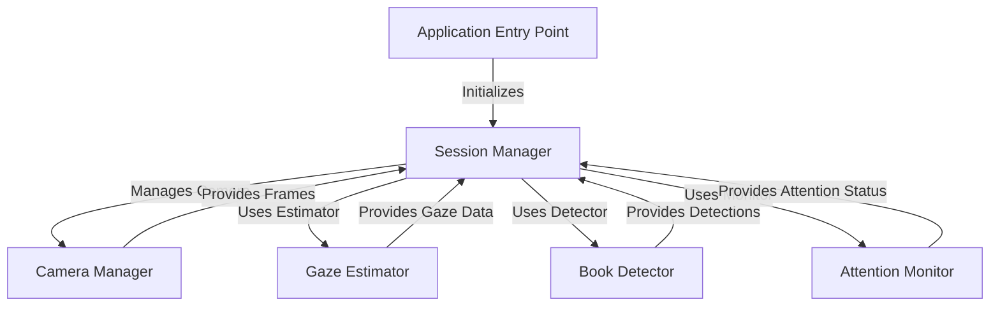

# Tutorial: Book-Attention-Monitor

This project is a **Book Attention Monitor** system. It uses a camera to **watch a person**, figure out **where they are looking** (gaze), and **detect if a book is present** and open. By combining the gaze direction and book location, it determines if the person is **attentive to the opened book** and shows this status live.

**Source Repository:** [None](None)

## Chapters

1. [Application Entry Point
](01_application_entry_point_.md)
2. [Session Manager
](02_session_manager_.md)
3. [Camera Manager
](03_camera_manager_.md)
4. [Gaze Estimator
](04_gaze_estimator_.md)
5. [Book Detector
](05_book_detector_.md)
6. [Attention Monitor
](06_attention_monitor_.md)

---

Generated by [AI Codebase Knowledge Builder](https://github.com/The-Pocket/Tutorial-Codebase-Knowledge)